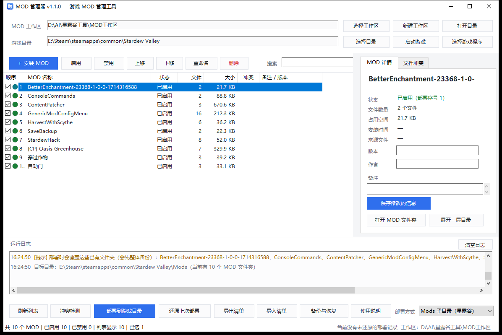

# MOD 管理器（Stardew Valley / 通用游戏 MOD 管理工具）

<p>
  
  
  
  
  
</p>

一个 **Windows 上的简体中文图形界面 MOD 管理工具**：安装、启用/禁用、排序、检查、一键部署到游戏，并且随时能一键还原。

单文件绿色版，约 130 KB，双击即用，**不需要安装**，不写注册表，也不修改游戏本体文件。

> An open-source Chinese GUI mod manager for Windows games (Stardew Valley / SMAPI and generic games).



---

## 特性

- **两种部署模式**

  | 模式 | 适用场景 | 行为 |
  | --- | --- | --- |
  | Mods 子目录（星露谷 / SMAPI） | 每个 MOD 一个独立文件夹的游戏 | 把每个启用的 MOD 整个文件夹复制到 `游戏目录\Mods\` |
  | 游戏根目录（通用） | 贴图 / 模型替换类游戏 | 按加载顺序把 MOD 里的文件合并复制到游戏根目录，同名文件按顺序覆盖 |

- **安装 MOD**：支持 `.zip`（内置解压）、`.7z` / `.rar`（调用系统 7-Zip / WinRAR），也可以直接把文件夹拖进窗口；自动清理 `__MACOSX`、`.DS_Store`、`Thumbs.db` 等垃圾文件；自动去掉压缩包多余的包装文件夹；同名 MOD 自动改名不覆盖。
- **启用 / 禁用**：勾选框一键切换（在 `mods` / `disabled` 之间移动文件夹，不动文件内容），支持多选、空格键、右键菜单。
- **加载顺序**：上移 / 下移调整优先级，靠后的 MOD 覆盖靠前的。
- **检查**：通用模式做文件级冲突检测（列出重复文件和最终生效的 MOD）；Mods 模式检查每个 MOD 是否含 `manifest.json`、部署会覆盖哪些已有文件夹。
- **部署 / 还原**：覆盖前自动备份到 `backup\deploy_时间戳\`，点「还原上次部署」可完全回到部署前状态；连续部署多次也能还原到最初状态。
- **备份与恢复**：删除 MOD 只是移动到 `backup\`，可在界面里一键找回（保留删除前的启用状态）。
- **导入已有 MOD**：右键列表即可把游戏 `Mods\` 里已经手动装好的 MOD 复制进工作区统一管理。
- **清单导出 / 导入**：把 MOD 列表、顺序、备注存成 json，换电脑时按名称匹配恢复。
- 启动游戏、拖拽安装、运行日志、备注/版本/作者，以及 `F5` / `Delete` / `空格` / `Ctrl+A` 快捷键。

---

## 快速开始（普通用户）

1. 下载 [`MOD管理器.exe`](MOD管理器.exe)（就在本仓库根目录）。
2. 双击运行。如果 Windows 弹出「Windows 已保护你的电脑」，点 **更多信息 → 仍要运行**（程序未购买代码签名，属正常提示）。
3. 点「新建工作区」选一个空文件夹 → 把 MOD 压缩包**拖进窗口** → 点「选择目录」指定游戏目录 → 点「部署到游戏目录」。

更详细的图文说明见 [使用说明.md](使用说明.md)。

### 星露谷（Stardew Valley）玩家要点

1. 把右下角「部署方式」切换为 **Mods 子目录（星露谷）**；
2. 「游戏目录」选到含 `Stardew Valley.exe` 的那一层；
3. 部署后，用 `StardewModdingAPI.exe`（SMAPI）启动游戏；
4. 已经手动装过的 MOD，可以在列表上点右键 →「导入游戏 Mods 目录中的现有 MOD」一次性纳管。

---

## 从源码编译

不需要安装 Visual Studio 或 .NET SDK，用系统自带的 .NET Framework 编译器即可（Windows 10 / 11 自带）：

```powershell
# 在仓库根目录执行
powershell -ExecutionPolicy Bypass -File .\build\build.ps1 -OutDir . -BuildTests
```

- 产物：`.\MOD管理器.exe`（`-OutDir .` 直接输出到仓库根目录）
- 测试程序：`.\work\CoreTests.exe`，直接运行即可看到 59 项用例结果

---

## 目录结构

```
├─ MOD管理器.exe          编译好的成品（单文件，可脱离源码运行）
├─ 使用说明.md             面向使用者的中文说明
├─ 界面预览.png
├─ src\                    C# 源码
│   ├─ Program.cs          程序入口、自检/截图模式
│   ├─ MainForm.cs         主界面与全部交互
│   ├─ Workspace.cs        核心逻辑：安装 / 启用 / 冲突检测 / 部署 / 还原
│   ├─ Model.cs            数据结构与 JSON 读写
│   ├─ Dialogs.cs          备份恢复等对话框
│   ├─ UiKit.cs            配色、字体、控件工厂
│   ├─ Util.cs             文件工具
│   ├─ Settings.cs         程序设置（%APPDATA%\MODManager）
│   └─ AssemblyInfo.cs
├─ build\build.ps1         一键编译脚本
├─ tests\CoreTests.cs      核心逻辑自动化测试（59 项）
└─ assets\                 应用图标与清单文件
```

工作区（你的 MOD 数据）结构：

```
工作区\
├─ mods\        已启用的 MOD（每个 MOD 一个文件夹）
├─ disabled\    已禁用的 MOD
├─ backup\      删除备份 / 部署备份 / 临时解压
└─ modmanager.json   游戏目录、部署方式、加载顺序、备注
```

---

## 技术说明

- C# + WinForms，目标 .NET Framework 4.x，**零第三方依赖**，编译产物只有一个 exe。
- 编译只需系统自带的 `csc.exe`（`%WINDIR%\Microsoft.NET\Framework64\v4.0.30319\csc.exe`），因此没有 MSBuild / SDK 也能构建。
- 核心逻辑（`Workspace.cs` / `Model.cs` / `Util.cs`）不依赖界面，被 `tests\CoreTests.cs` 直接引用做自动化测试。
- 解压 zip 时校验每个条目的落地路径，防止 zip-slip 路径穿越。

## 常见问题

**部署后游戏里没生效？**
确认部署方式选对了（星露谷必须用 Mods 模式）、游戏目录指向游戏安装根目录、用 SMAPI 启动游戏。

**提示「未检测到 7-Zip」？**
装一个 [7-Zip](https://www.7-zip.org/) 即可解压 7z / rar；或者先手动解压，再把文件夹拖进工具。

**会把游戏弄坏吗？**
不会。工具只按你的指令复制文件，且覆盖前先备份，随时可以「还原上次部署」。

**需要管理员权限吗？**
一般不需要；游戏装在 `C:\Program Files` 等受保护目录时，请右键以管理员身份运行。

## 贡献

欢迎提 Issue 和 PR。提交前建议先跑一遍 `.\work\CoreTests.exe`，确保 59 项用例全绿。

## 许可证

[MIT](LICENSE)
