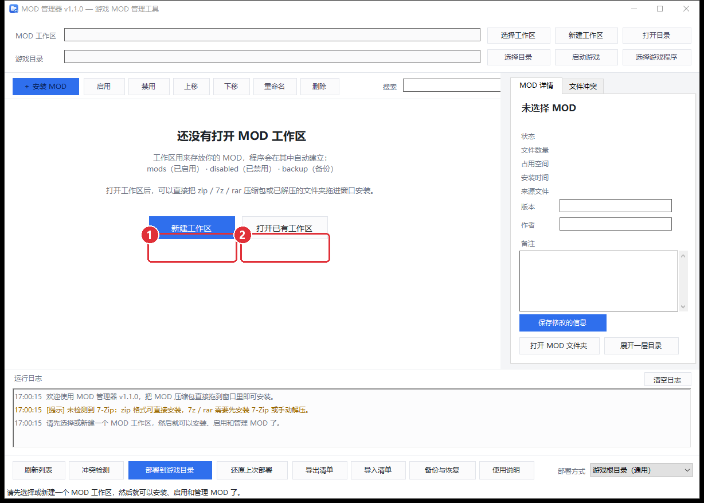
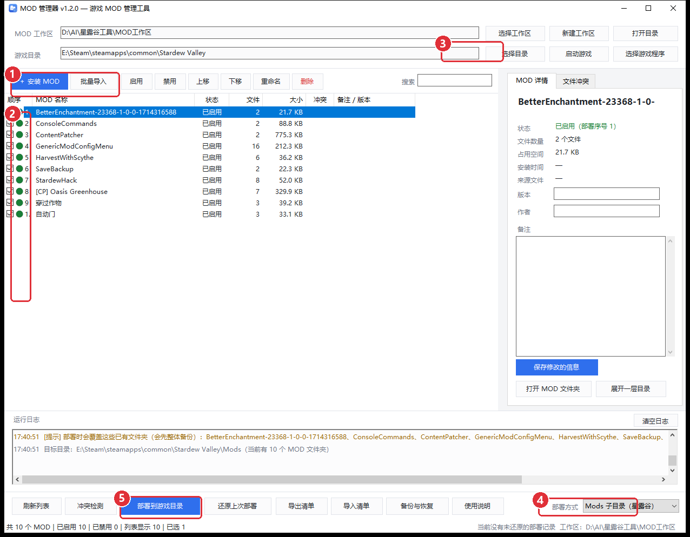

# 新手图文教程：从下载到进游戏（照着点就行）

> 适用版本：MOD 管理器 v1.2.0 ｜ 全程不需要安装任何东西，也不需要懂命令行。

---

## 第 0 步：运行程序

1. 下载 `MOD管理器.exe`（只有一个文件，约 130 KB），放到**任意文件夹**（例如 `D:\AI\MOD管理器\`）。
2. 双击运行。
3. 如果 Windows 弹出蓝色的 **「Windows 已保护你的电脑」**：点 **更多信息 → 仍要运行**。
   （因为这个 exe 没买数字签名，属于正常提示，不是病毒。）
4. 不需要管理员权限；把 exe 放在哪里都行，**不要**把它放进游戏目录里也没关系。

---

## 第 1 步：建立「工作区」（第一次必做）



**工作区**就是用来存放你所有 MOD 的文件夹，随便选一个空文件夹即可（建议单独建一个，例如 `D:\MOD库\星露谷`）。

1. 点 **①「新建工作区」** → 弹出文件夹选择框 → 选中那个空文件夹 → 确定；
2. 程序会自动在里面建立三个子目录：
   - `mods\`　已启用的 MOD
   - `disabled\`　已禁用的 MOD
   - `backup\`　删除备份 / 部署备份（万一装错可以找回）
3. 如果**已经有工作区**（比如换电脑、迁移过），就点 **②「打开已有工作区」** 直接选那个文件夹。

> 工作区跟游戏目录是两回事：工作区是"你的 MOD 仓库"，游戏目录是"游戏本体所在位置"，下一步会分别设置。

---

## 第 2 步：认识主界面



| 编号 | 位置 | 作用 |
| --- | --- | --- |
| ① | 左上角蓝色按钮 | **安装 MOD**：点它选压缩包；也可以直接把 zip 拖进窗口 |
| ② | 列表最左边的复选框列 | **勾选 = 启用，取消勾选 = 禁用**（只是把文件夹在 mods / disabled 之间移动，不改文件内容） |
| ③ | 右上「选择目录」 | **指定游戏目录**（游戏本体所在文件夹） |
| ④ | 右下「部署方式」下拉框 | 选择用哪种方式装进游戏（星露谷选 **Mods 子目录**） |
| ⑤ | 底部蓝色按钮 | **部署到游戏目录**：把已启用的 MOD 真正装进游戏 |

其他有用的小地方：

- 右边「MOD 详情」面板：填写版本 / 作者 / 备注，点「保存修改的信息」；
- 右侧「文件冲突」标签页：看哪些 MOD 会互相覆盖；
- 中间「运行日志」：每一步操作都有记录，出问题看这里；
- 底部一排：「冲突检测 / 检查」「还原上次部署」「导出清单 / 导入清单」「备份与恢复」「使用说明」。

---

## 第 3 步：装 MOD

两种方式，任选其一：

1. **点 ①「＋ 安装 MOD」**：在弹出的文件框里选中一个或多个压缩包（可按住 Ctrl 多选）；
2. **直接拖进窗口**（推荐）：把下载好的 `.zip`（或 `.7z` / `.rar`，或者已经解压好的文件夹）用鼠标拖到窗口中间松手。

装好后会出现在左侧列表里，并且**默认就是「已启用」**（勾是打上的）。

小提示：

- `.zip` 不需要任何额外软件；`.7z` / `.rar` 需要电脑里装了 7-Zip 或 WinRAR；
- 程序会自动清理 `__MACOSX`、`Thumbs.db` 这类垃圾文件，也会自动去掉压缩包多套的一层外壳文件夹；
- 如果列表里同名 MOD，会自动改名为 `名字 (2)`，不会覆盖旧的。

### 一次装一堆 MOD（推荐）

如果你下载的是一整包 MOD，或者像下面这样按分类整理好的文件夹：

```
D:\Downloads\模组工具\
├─ 宠物\艾尔的马匹\
├─ 美化\[CP] Mr Qi Beautification\
├─ 游戏机制\更多戒指\
└─ 扩展包\SVE\
```

**不用一个一个拖**，直接：

1. 点工具栏的 **「批量导入」**（或把这个文件夹直接拖进窗口）；
2. 弹窗会告诉你「找到 71 个 MOD，将导入 64 个，跳过 7 个（已装过的）」；
3. 点确定，全部自动装好。

工具会按 `manifest.json` 里的显示名给 MOD 命名，按 `UniqueID` 去重 —— 同一个 MOD 不会重复装，两个同名 MOD 会自动区分开。

---

## 第 4 步：指定游戏目录 + 选部署方式

**（1）点 ③「选择目录」**，选中游戏安装目录：

| 游戏 | 应该选哪个文件夹 |
| --- | --- |
| 星露谷 | `...\steamapps\common\Stardew Valley`（**有 `Stardew Valley.exe` 的那一层**） |
| 其他游戏 | 一般是游戏的安装根目录（有游戏主程序 exe 的那层） |

**（2）点 ④ 下拉框**，选择部署方式：

| 选项 | 什么时候用 | 效果 |
| --- | --- | --- |
| **Mods 子目录（星露谷）** | 星露谷 / SMAPI，以及"每个 MOD 一个文件夹"的游戏 | 每个 MOD 整个文件夹复制到 `游戏目录\Mods\` |
| **游戏根目录（通用）** | 贴图替换、模型替换类游戏 | MOD 里的文件按顺序合并复制到游戏根目录，同名文件后面的覆盖前面的 |

不确定的时候，点一下 **「冲突检测」/「检查」** 按钮，程序会在日志里告诉你：
目标目录到底是哪里、当前里面有几个 MOD、这次会覆盖哪些文件。

---

## 第 5 步：部署进游戏

1. 确认要用的 MOD 都打了勾（②）；
2. 点 **⑤「部署到游戏目录」** → 弹出确认框 → 确定；
3. 看到「部署完成」就装好了：
   - **星露谷**：MOD 出现在 `Stardew Valley\Mods\`，然后用 **`StardewModdingAPI.exe`（SMAPI）** 启动游戏；
   - **其他游戏**：直接启动游戏即可。

> 被覆盖的文件 / 文件夹会先整体备份到工作区的 `backup\deploy_时间戳\`，
> 所以随时都能用「还原上次部署」把游戏恢复到部署前的状态。

---

## 第 6 步：改主意了怎么办

| 我想要 | 怎么做 |
| --- | --- |
| 关掉某个 MOD | 取消勾选 ② → 再点一次 ⑤「部署到游戏目录」 |
| 重新打开 | 重新勾上 ② → 再部署一次 |
| 撤销整个部署 | 点「还原上次部署」 |
| 删错了 MOD | 点「备份与恢复」→ 选中 → 「恢复选中的 MOD」 |
| 把已经手动装在游戏里的 MOD 纳管 | 在列表上点**右键** →「导入游戏 Mods 目录中的现有 MOD」 |
| 调换两个 MOD 的优先级 | 选中后点「上移 / 下移」（通用模式下才有意义） |
| 换电脑 / 备份 MOD 清单 | 「导出清单」保存成 json，到新电脑点「导入清单」 |

---

## 常见问题

**Q：点安装时提示「未检测到 7-Zip」？**
说明你装的是 7z / rar 压缩包。装一个 [7-Zip](https://www.7-zip.org/)，或者先用压缩软件手动解压，再把解压出来的**文件夹**拖进本工具（文件夹不需要 7-Zip）。

**Q：部署完了，游戏里却没变化？**
按顺序检查三点：
1. ④ 部署方式选对了吗（星露谷必须是「Mods 子目录」）；
2. ③ 游戏目录是不是游戏安装根目录（不是存档目录、不是 Mods 目录）；
3. 星露谷要用 `StardewModdingAPI.exe` 启动，普通启动不会加载 MOD。

**Q：会不会把游戏弄坏？**
不会。程序只按你的指令复制文件，覆盖前一定先备份；点「还原上次部署」就能完全恢复。重要存档建议自己另外备份一份。

**Q：需要管理员权限吗？**
一般不需要。如果游戏装在 `C:\Program Files` 这类受保护目录，部署被拒绝时，右键 exe →「以管理员身份运行」再试。

**Q：换电脑怎么迁移？**
把整个**工作区文件夹**（含 `mods`、`disabled`、`backup`、`modmanager.json`）复制过去，在新电脑上点「打开已有工作区」即可；游戏目录重新选一次就行。

**Q：怎么彻底卸载？**
删掉 `MOD管理器.exe` 和 `%APPDATA%\MODManager` 文件夹即可；工作区文件夹是你自己的数据，按需保留。
